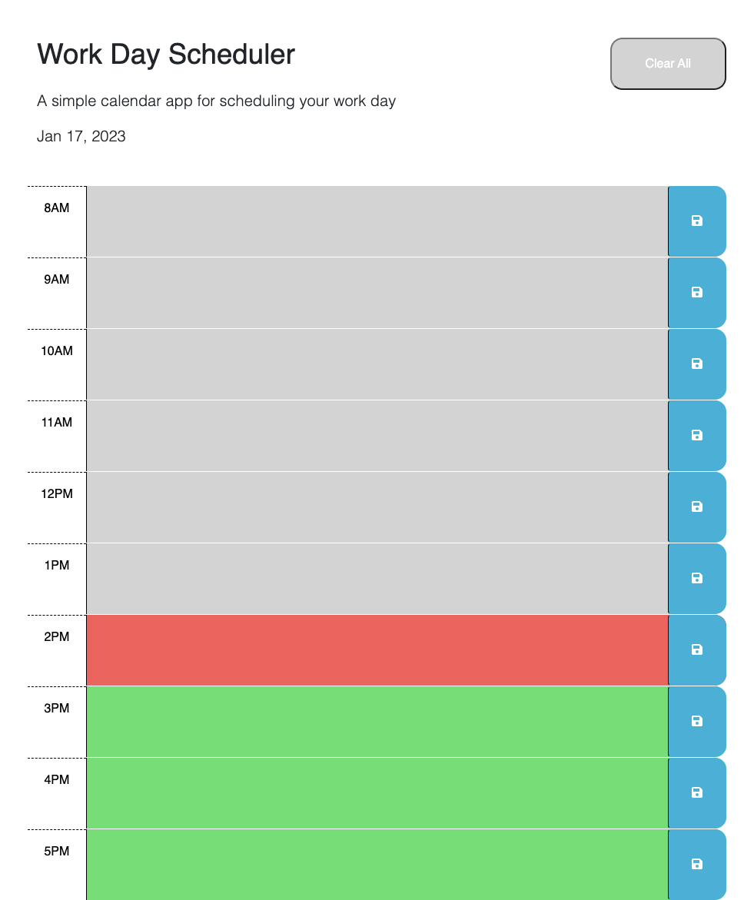

# Work Day Scheduler

## Description

This work day scheduler can be used by anyone with a busy schedule to plan their day. 
Users can save their tasks to time-blocks. 
The objective of this project was to use the third party APIs and local storage to create a dynamic work day scheduler.

## Installation

N/A

## Usage

This app can be used to schedule a user's tasks. 
Users can enter their tasks in to a text area for each hour. 
When the user clicks the save button, their input will be saved to local storage and displayed in the same timeblock, persisting upon page refresh.  

[Deployed Website Link](https://ameliabigler.github.io/reasonable-crustacean/)

## Credits

I referenced jQuery documentation for details on the .each() method:
https://api.jquery.com/each/

I referenced this site for how to use a variable in jQuery document query selector:
https://www.daniweb.com/programming/web-development/threads/517437/use-variable-in-document-queryselector

I referenced this site for details on local storage persisting after window refresh:
https://stackoverflow.com/questions/44564795/how-to-keep-localstorage-values-after-refresh

## License

Please refer to the license in the repo.